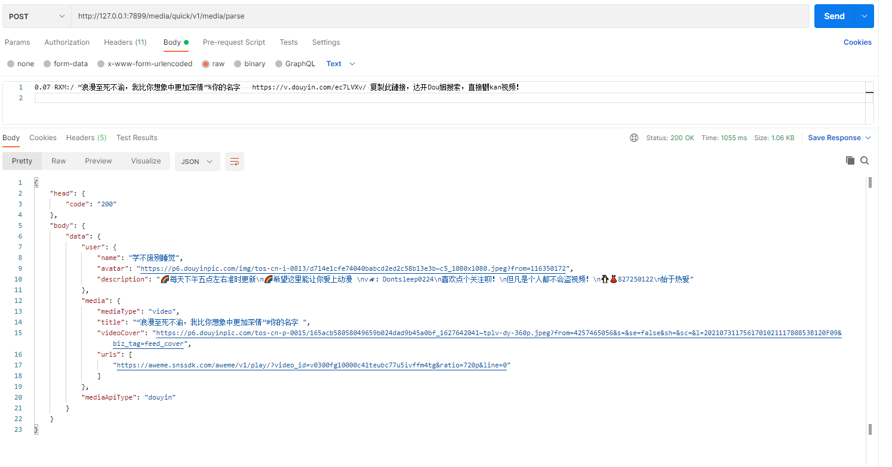
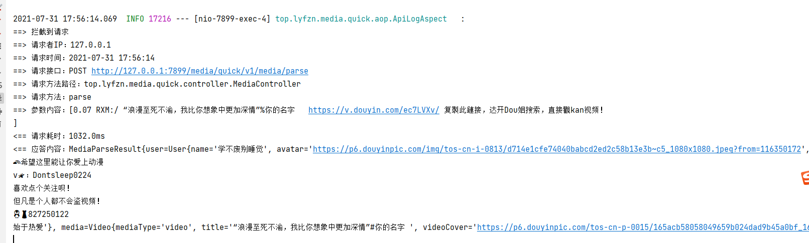

# MediaQuickServer
## 介绍
```text
本项目采用SpringBoot框架开发
支持解析内容：
    抖音：单个视频、相册
    快手：单个视频、相册
    微博：单个视频
    网易云音乐：单个视频
```
接口文档：[api-doc](./api-doc/AllInOne-V202107311753.md)  
安卓APP：[MediaQuickAndroid](https://github.com/zbfzn/MediaQuickAndroid)(须结合MediaQuickServer使用)

## 环境要求
```text
maven3
java版本不小于1.8
```

## 编译
```text
项目根目录下运行：
# 安装依赖
mvn install

# 打包
mvn package
```

## 运行
```text
java -jar media-quick-server-1.1.jar
```
## 解析示例
```text
0.07 RXM:/ “浪漫至死不渝，我比你想象中更加深情”%你的名字   https://v.douyin.com/ec7LVXv/ 复製此鏈接，达开Dou姻搜索，直接觀kan视频！
```

控制台输出


#### 创作不易，给个star呗(✪ω✪)
## 注意
<font style="color: #ff0000">仅供学习交流使用。 如用本程序于非法用途所导致的后果自负,与作者无关。</font>  

